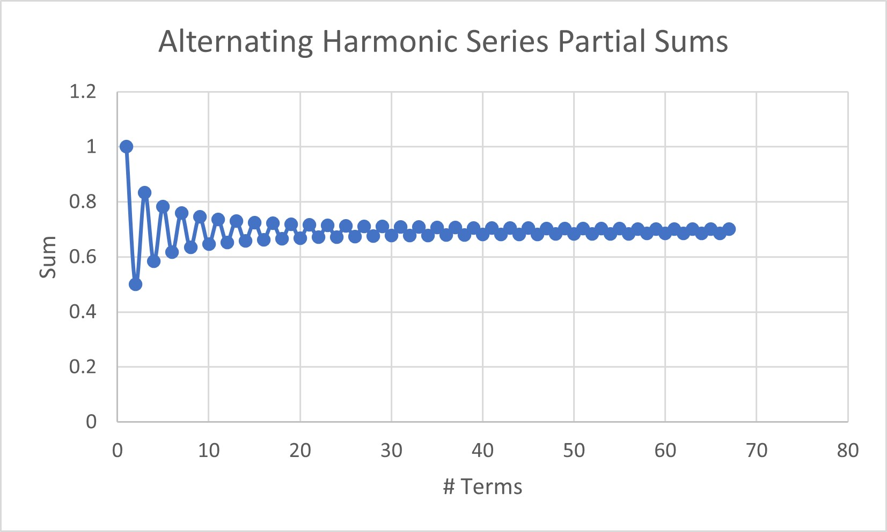
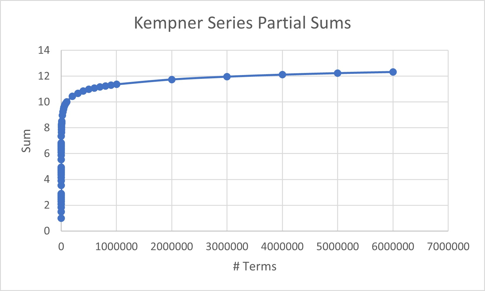

# Infinite Series' with Computers

Suppose you want to implement numerically a way to calculate
$$
\sum_{n=0}^N n
$$
for some $N\in\mathbb{Z}$. Programming makes this easy with the `for` loop:
```
for (int n = 0; n <= N; n++) {...}
```
## The Alternating Harmonic Series
The alternating harmonic series, given as
$$
1-\frac{1}{2}+\frac{1}{3}-\frac{1}{4}+...
$$
can be summed completely by a simple loop:
```
int i = 1; double sum_alt = 0;
while(1) {
    sum_alt+=pow(-1,i+1)/double(i);
    i++;
}
```
However, it is obvious that we cannot sum terms forever, so the condition in the loop must be changed. Instead, we continue adding terms until they stop contributing to the total sum. I find the change in the average value in the sum before and after the term is added, and compare it with a `precision` variable that can be adjusted by the user. The higher the value of the precision ($\epsilon$), the more terms are added. Formally, the series will not stop adding more terms until $\left|\frac{S_{n+1}}{n+1}-\frac{S_n}{n}\right|<\varepsilon$. A function `terms_still_contributing()` is defined to handle this check in the while condition. With a precision of $\varepsilon = 0.01$, after $n = 67$ terms, the sum converged to $0.70055$. The partial sums are plotted below. The sums were written to csv file. 

## The Kempner Series
The Kempner 'depleted' series is defined to be 
$$
\sum_{i=1}^{\infty} \frac{1}{i}
$$

where $i$ is all integers without a $9$ somewhere in its decimal representation. Another while loop can be created with a similar condition as the alternating harmonic series, however the increment must change. A function is created in order to maintain incrementing to avoid integers with $9$ in them:
```
int kemper_increment(int x) {
    string str = to_string(x);
    int i = str.find("9");
    if (i == string::npos) return x;
    else return kemper_increment(x+pow(10,labs(i-(str.length()-1))));  
}
```
First the function converts the integer to a string, then finds the index of the first $9$ in the string. If no $9$ is found, the original number is returned. If one is found, the number is incremented by $|10^{i}|$, where $i$ is the number of places from the ones place that the $9$ was found, starting at $0$. This is done recursively for numbers such as $889$: first a $9$ is found in the ones place: so add $10^0$ which is $890$. Now a $9$ is found in the tens place, so add $10^1$ which is $900$. Now a $9$ is found in the hundreds place, so add $10^2$ which is $1000$. With this incrementing function, a while loop can again be constructed to sum all of the terms:
```
int i = 1; double sum_kemp = 0;
while(1) {
    sum_kemp += 1/double(i);
    i = kemper_increment(i+1);
}
```
Again, we cannot sum terms forever, so the `terms_still_contributing()` function is used. With a precision of $\varepsilon = 0.0000001$, after $n = 59644817$ terms, the sum converged to $13.42073$. I used a low precision because I wanted to get as many terms as possible to see if it really converged any faster than the harmonic series. The partial sums are plotted below. 
