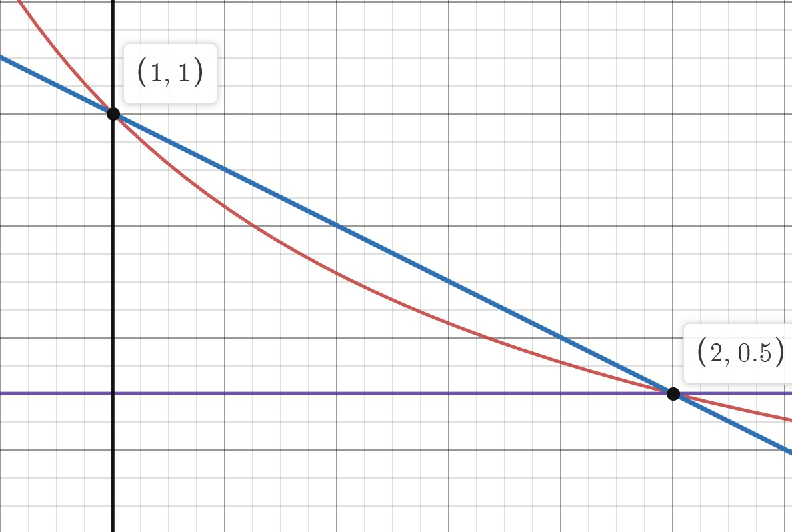
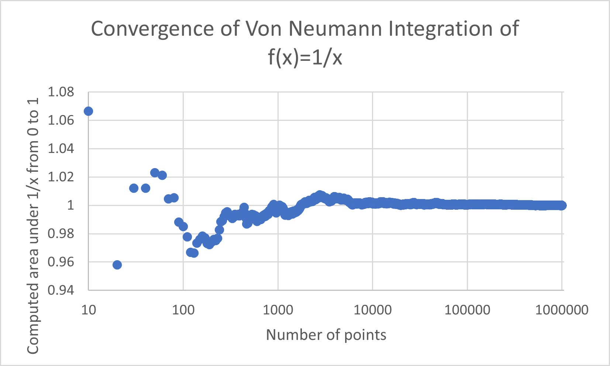
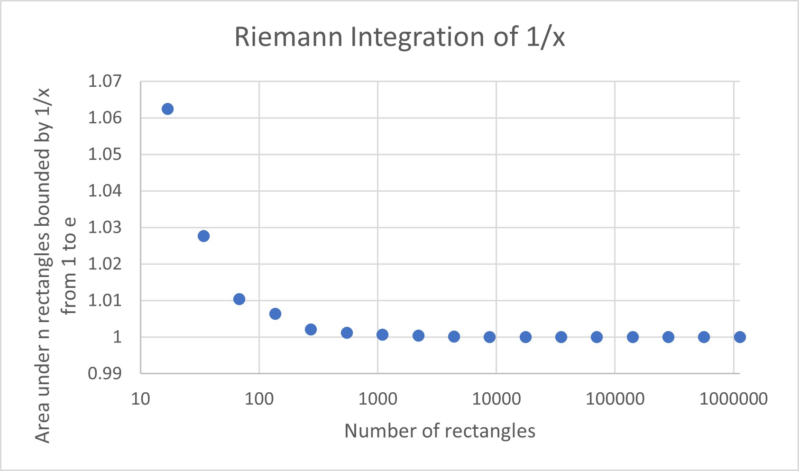

# Monte Carlo Integration
One method of computing the area under a curve is to draw a bounding box around that curve, sample random points in that box, and find the area by multiplying fraction of points under the curve times the total area of the bounding box. For a curve that has a maximum height $h$ on the interval $[a,b]$, the computed area under the curve  over that interval will be

$$
A=\frac{\text{\# random points under the curve}}{\text{\# random points}}(b-a)h
$$

It may also be useful to obtain an approximation of the bounds of an integrated function, knowing the area and the function. This is the case for the homework this week. It is known that the integral $\int_1^e\frac{1}{x}dx = 1$. Due to this, we can use Monte Carlo integration to integrate this curve from 1 to different numbers until we found the bound ($e$) such that the area is 1. I used a while loop to obtain this, and in each iteration of this loop an entire Monte Carlo integration is done from 1 to $b$. I randomly selected $b$ initially from 1 to 10, but each time I get an area larger than 1 I set the upper bound of $b$ to that value, and if I get an area smaller than 1 I set the lower bound of $b$ to that value. This is similar to bisection search except I am randomly sampling in the interval instead of picking the midpoint. The random bounds of $b$ very quickly converge close to $e$. Another consideration I took is that there is wasted space using a box from $(1,0)$ to $(b,1)$. 
## Uniform Coordinates in the Bounding Shape
I decided to draw a triangle to reduce wasted space. It cuts off a rectangle at the bottom of the curve of width $b$ and height $1/b$. I must add this to the computed area under the curve.
As for the top, I had to draw a bounding line. That line is given by the following equation for a given $b$:

$$
y=\frac{\frac{1}{b}-1}{b-1}x+1-\frac{\frac{1}{b}-1}{b-1}
$$


*The triangle being drawn with a b value of 2*

The next part is to obtain uniform random coordinates in the triangle. This proved more difficult than expected. For points to not be clustered, the distribution of initial $x$ (or $y$, whichever is randomized first) values cannot be uniform. The probability must be weighted by the coresponding range of possible values for the other coordinate. One way of doing this is to use the square root of a uniform random distribution from 0 to 1: `sqrt(rand(0,1))`. This function has the property that the probability is weighted such that the probability to get a point is proportional to the point, so points near 1 are more likely than points near 0. To adjust this to my problem, I subtract that function from 1 so that points near 0 are more likely to accomodate the larger range of $y$ values at $x$ near 0. Then I just scale and shift the triangle from being a uniform triangle with vertices $(0,1),(0,0),(1,0)$ to $(1,1),(1,1/b),(b,1/b)$. Finally, with a bounding shape and a uniform coordinate distribution in that shape, monte carlo integration is done with the triangle. The area is computed by the fraction of the points under the curve in the triangle, remembering to add back the rectangle cut from the bottom of the curve:

$$
A=\frac{\text{\# random points under the curve}}{\text{\# random points}}\cdot \frac{1}{2}(1-\frac{1}{b})(b-1)+\frac{1}{b}(b-1);
$$

$b$ converged to a value of $2.718182539328$ with a precision (comparing the area to 1) of $1\times10^{-6}$. 

*A plot of the computed areas in final iteration of the integration to the converged $b$ value.*

# Riemann Integration
Numerical Riemann integration is also quite simple and given a function $f(x)$, step size $dx$, and bounds $a$ and $b$ can be done in the following simple way:
```
double area = 0;
for (double x = a; x < b; x += dx) {
    area += f(x)*dx;
}
```
I have written it the same way we do in calculus to demonstrate its simplicity: $\int_a^bf(x)dx$. The goal was to start with a few rectangles and use more and more until the integration of $\frac{1}{x}$ from 1 to $e$ is 1. 


*Areas computed using different numbers of rectangles*


The final value of the integral within desired precision was $1.000009299846$. It can be seen that Riemann integration converges to the correct value much faster. The plot of the monte carlo integration shows a fairly significant variance in the computed area until about $10000$ points. On the plot of Riemann integration the variance is basically nothing at $1000$ rectangles. In both situations, the answer was still close even just after $10$ trials, but the convergence to the true value takes longer with the Monte Carlo method. This makes sense because its possible, just unlikely, for the Monte Carlo technique to give the wrong answer. This is why many more points are needed. For Riemann integration, the answer is guaranteed to converge to the correct value given the rectangle width goes to zero.
