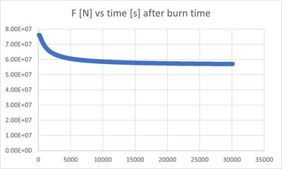
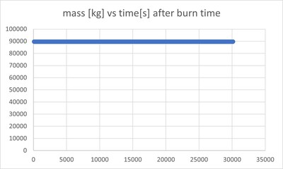
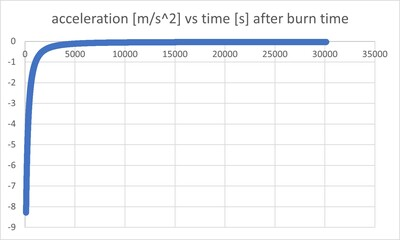
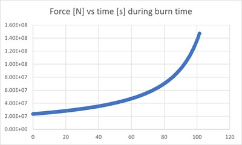
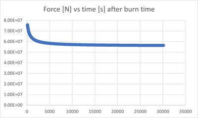
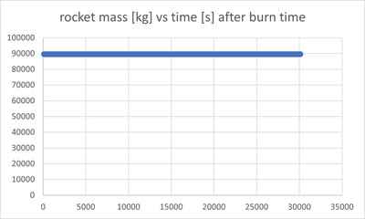

We can also use computers to simulate time steps in differential equations in order to determine how a system with a particular set of initial conditions will behave. One method of doing this is Euler's method. Here we will be using the Euler Method and a variant to solve the following equation numerically to find how long a rocket will take to get to the moon:

$$
-mg=ma+\dot{m}v
$$

Euler's method can be summed up in two steps. Solve for the differential equation for $a$. Apply the truncated taylor series expansion to $v$ and $h$ (where $h$ is the height of the rocket):

$$
v_{n+1} = v_n+a_n\Delta t 
$$

$$
h_{n+1} = h_n+v_n\Delta t
$$

In each iteration of the loop, the values of $a_n$, $v_n$ and $h_n$ get updated. I began by imposing initial conditions on the rocket. $h(t=0)$ is the radius of the Earth, $v(t=0)=3000$ m/s which is the starting upward velocity. Next, I needed the parameters of the rocket. I used ones approximated from the characteristics found [here](https://en.wikipedia.org/wiki/Space_Shuttle_Solid_Rocket_Booster).
With the value of $\dot{m}$ being determined by these rocket parameters, equation $(1)$ is only missing one variable: 

$$
g=\frac{GM_e}{h^2}
$$

Now I just solved equation (1) for $a$ to update $a_n$ in each loop iteration:

$$
a=-g-\frac{\dot{m}v}{m}
$$

After I do this running the Euler method is simple, the loop condition is when $h$ is still smaller than the distance to the surface of the moon. $v_n$ and $h_n$ get updated as described in $(2)$ and $(3)$. The only complication is checking that the rocket does not continue expelling fuel when the total mass equals the empty mass. After that point, $a$ just becomes $g$. After running the code, the total time it took to for the rocket to travel from the earth to the moon using Euler's method was $30123.5$ seconds or $8.368$ hours, and the $\Delta v = 12689.7$ m/s. Below are plots of the force, rocket mass, total acceleration, gravitational acceleration, velociy, and height from Earth's center vs time. 

  
  
  
   

 

Lets now use the Euler-Cromer method, which replaces a single term in equation (3):

$$
h_{n+1}=h_n+v_{n+1}\Delta t
$$

Everything else is the same. There is only a slight change in code for this method, I changed the `height[1][0]` term used for Euler to `height[1][1]` for the last-point approcimation method used in Euler-Cromer. The total time for the trip using this method was computed to be $30110.5$ or $8.364$ hours (slightly less than Euler), and the $\Delta v = 12690.5$ m/s. The plots of the same variables vs time are below.

  
  
  
   

