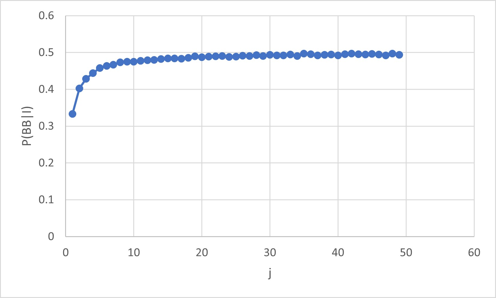

# Monte Carlo Simulation
Suppose we want to know the likelihood of an event given its prior likelihood and other information. It is useful to use a method of randomly sampling using the prior likelihood and simulate a large number of trials where the other information is satisfied to find the posterior probability. This is known as Monte Carlo simulation. Today we are asked two questions that will be solved using this method:
- I have two children. At least one is a boy. What is the probability that I have two boys?
- I have two children. At least one is a boy born on tuesday. What is the probability that I have two boys?
## 1. $P(BB|\geq 1\text{boy}, \mathcal{I})$
For the first problem, we begin by setting up a known prior likelihood distribution for being born as a boy or girl, assumed to be exactly $\frac{1}{2}$:
```
default_random_engine generator;
uniform_int_distribution<int> gender_distribution(0,1);
```
Next, since we are looking for an experimental probability, we will need to know the total number of desirable outcomes and the total number of trials. We initialize them at zero, and an arbitrarily chosen large number, respectively:
```
int count_both_boys = 0;
int num_trials = 1E5;  
```
Finally to run the simulations, we loop over the number of trials, sampling outcomes from the distribution and throwing out any irrelevant results. Here, since we know that there is at least one boy, we sample a gender for each child and only resample when both were girls.
```
for(int i = 0; i < num_trials; i++) {
    int child_one, child_two; 
    do {
        child_one = gender_distribution(generator);
        child_two = gender_distribution(generator);
    } while (child_one + child_two == 0);
    if (child_one + child_two == 2) 
        count_both_boys++;
}
```
At this point the experimentally-found probability is just \verb+count_both_boys+ / \verb+num_trials+. Out of $100000$ trials where someone has at least one son, $33230$ of them had $2$ boys. $P(BB|\geq 1\text{boy}, \mathcal{I}) = \frac{33230}{100000} \approx \frac{1}{3}.$

## 2. $P(BB|\geq 1\text{boy},\text{born on tuesday}, \mathcal{I})$
This approach to this problem will be almost exactly the same except we now need to consider the distribution of weekdays children can be born on. Assuming each day is equally likely we initialize the distribution:
```
uniform_int_distribution<int> weekday_distribution(1,7);
```
And now the solution is basically the same: we loop over the number of trials, sampling genders for the children and weekdays they were born, again throwing out samples,this time where there isnt at least one boy born on tuesday. The choice of '2' meaning tuesday is obviously arbitrary - all that matters is that the probability to get 2 in that distribution is the same as being born on tuesday:
```
for(int i = 0; i < num_trials; i++) {
    int child_one_day, child_two_day;
    do {
        child_one = gender_distribution(generator);
        child_one_day = weekday_distribution(generator);
        child_two = gender_distribution(generator);
        child_two_day = weekday_distribution(generator);
    } while((child_one && child_one_day == 2) || (child_two && child_two_day == 2) == 0);
    if (child_one + child_two == 2) 
        count_both_boys++;
}
```
Out of $100000$ trials where someone has at least one son born on tuesday, $46287$ of them had $2$ boys. $P(BB|\geq 1\text{boy},\text{born on tuesday}, \mathcal{I}) = \frac{46287}{100000} \approx \frac{13}{27}.$

## What about with more information?
The problem described in section 2 can be generalized to other similar problems by recognizing that being born on tuesday is just knowledge about the boy without which there would be 7 equally likely options (all the weekdays). Information in this context is seen as how specific the information we have is. A higher value of $j$ means the information you have about the boy is more specific; for example knowing his birthday of the year would have $j=365$. A lower value provides less specific information, such as the boy prefers chocolate or vanilla ice cream ($j=2$). The same MC simulation from section 2 is run using a $j$ value from $1$ to $50$. A plot of the probability converging to $\frac{1}{2}$ as $j$ grows large is shown below:


